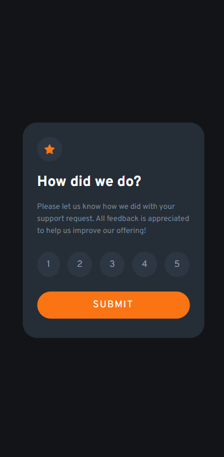

# Frontend Mentor - Interactive rating component solution

This is a solution to the [Interactive rating component challenge on Frontend Mentor](https://www.frontendmentor.io/challenges/interactive-rating-component-koxpeBUmI). Frontend Mentor challenges help you improve your coding skills by building realistic projects. 

## Overview
This is interactive rating component challenge in which the user must be able to select the rating numbers and click the submit button to get a thank you message showing the number picked by the user out of the given numbers.

### The challenge

Users should be able to:

- View the optimal layout for the app depending on their device's screen size.
- See hover states for all interactive elements on the page.
- Select and submit a number rating.
- See the "Thank you" card state after submitting a rating.

### Screenshot

This is the normal view of the rating card component. This image shows the rating section which has a star icon, a heading, a description, the rating numbers and a submit button.

When the user selects a rating and clicks the submit button the thank you section is revealed. This section has an image, a heading showing the number selected by the user out of the given numbers, another heading which has Thank You! and a description.

When the user hovers over the submit button the hover effects gets triggered and the background color changes to White and the text color changes to Orange. When the user clicks a rating number, the background color of the container changes to Orange and the text color changes to White. Also the hover effect on the clicked rating number gets removed.

The mobile view of the rating section.

Thank you section's mobile view.

### Links

- Solution URL: [Add solution URL here](https://your-solution-url.com)
- Live Site URL: [Add live site URL here](https://your-live-site-url.com)

## My process

### Built with

- Semantic HTML5 markup
- CSS custom properties
- Flexbox
- CSS Grid
- Mobile-first workflow
- JQuery

### Continued development

I need to further change the css to make the website as similar as the design provided.

### Useful resources

- [JQuery](https://www.example.com) - This helped me to minify the usage of JavaScript code.
- [ChatGPT](https://chat.openai.com/) - I used chatgpt to clear my doubts when I got stuck at several parts of the project.

## Author

- Frontend Mentor - [@HarshaVardhanNandamuri](https://www.frontendmentor.io/profile/HarshaVardhanNandamuri)
- LinkedIn - [@Bhanu Harsha Nandamuri](https://www.linkedin.com/in/bhanu-harsha-nandamuri-b31a80149/)

